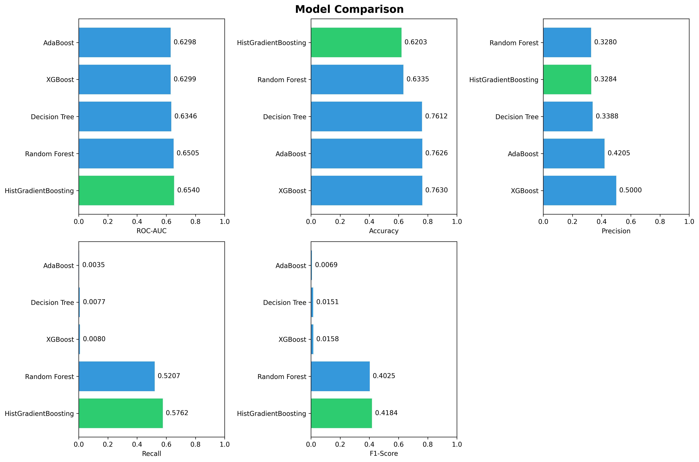
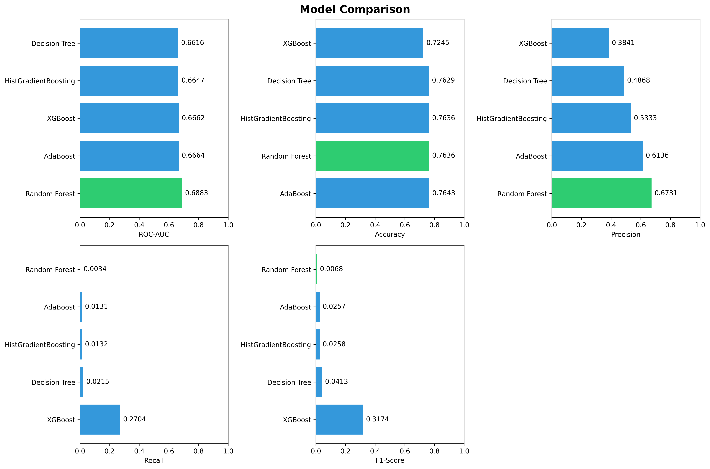
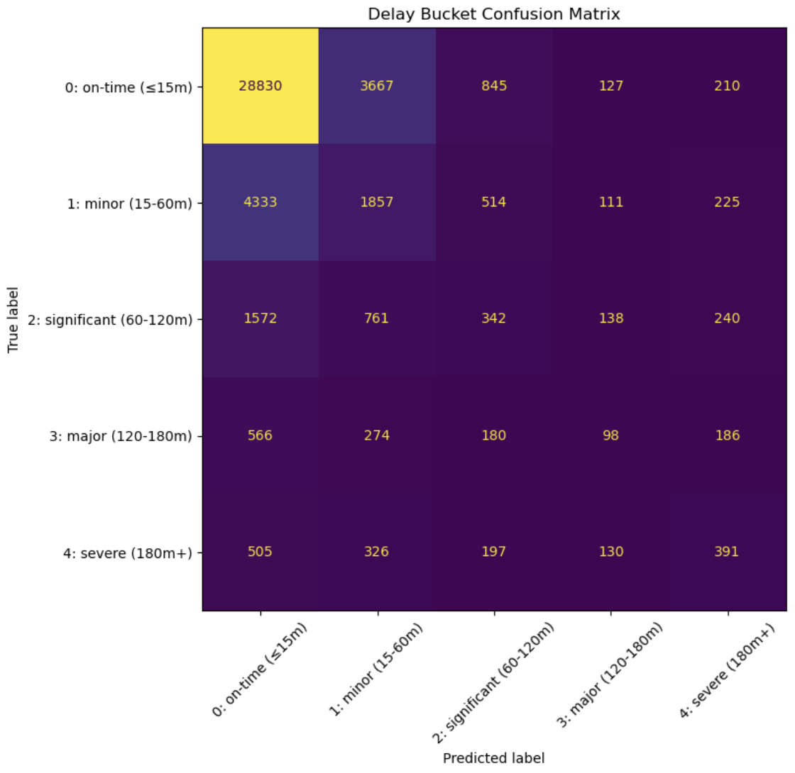
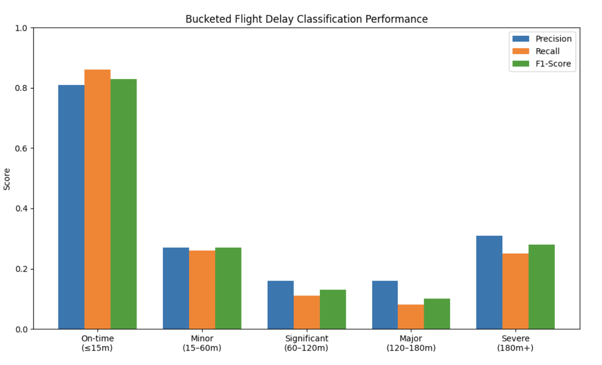

# Abstract

In this project, we developed machine learning models to classify and predict flight delays for flights departing from Washington National Airport (DCA). We collected and cleaned a large dataset of flight and weather data, engineered features based on prior research and domain knowledge, and trained several tree-based classifiers to predict whether a flight would be delayed or not. We also experimented with predicting delay severity using a "buckets" classification approach. Our results showed that incorporating additional features such as aircraft model information and rolling average delay by route improved model performance compared to a baseline model inspired by prior work. We discuss our methodology, results, and lessons learned throughout the project.

# Deliverables

Our deliverables for this project include [our code base](https://github.com/GW-ML-Flight/Flight-Delay), trained model weights, and our cleaned dataset of flight and weather data. Most of these are described in further details in other sections, but this report and the [project README](https://github.com/GW-ML-Flight/Flight-Delay/blob/main/README.md) are good places to see our deliverables.

## Models

Our trained model weights are located in the [`models` directory](https://github.com/GW-ML-Flight/Flight-Delay/tree/main/models). Within that directory, there are subdirectories for different models; for example, the [`wang` directory](https://github.com/GW-ML-Flight/Flight-Delay/tree/main/models/wang) has our implementation of the @wangCalibratedExplainableFlight2026 paper, but for DCA. Within the model folders, there's a JSON with data about our training (including hyperparameters and metrics on the different models), a PNG comparing the different models various metrics, and a `pkl` file with the trained model (the best from our hyperparameter/model search) that can be loaded to predict from later.

## Data

Our cleaned datasets are located in the [`data` directory](https://github.com/GW-ML-Flight/Flight-Delay/tree/main/data). Within that, there's a subdirectory for weather data and multiple for flight data.

### Weather Data

For the weather data, there are CSVs with raw sensor data from the NOAA ISD dataset [@nationalcentersforenvironmentalinformationGlobalHourlyIntegrated]. There's a Python file that processes those CSVs to clean that data and make it more usable as features in our models. There is also a notebook that combines the ISD Lite dataset with some information from the full dataset that provides additional information. Finally, there is a `parquet` file that contains the final cleaned weather data.

### Flight Data

The flight delay datasets are split between the [`data/flights`](https://github.com/GW-ML-Flight/Flight-Delay/tree/main/data/flights) and [`data/flight_info`](https://github.com/GW-ML-Flight/Flight-Delay/tree/main/data/flight_info) directories. The actual specific flight data is all within `flights`, and then some lookup tables are in `flight_info`. The main flight delay tables were all taken from the Department of Transportation datasets. The lookup tables helped to fill in information, especially regarding the aircraft registration database, as much of the data was kept as codes.

Additionally, we have two main scripts. `combineDelaySheets.py` combines the data from the Bureau of Transportation Statistics [@bureau_of_transportation_statistics_airline_nodate] and filters for the dates and airport of interest. The script dumps the result into an intermediary file, `Flight_delay.parquet`. The second main script adds in the data from the Federal Aviation Administration [@department_of_transportation_aircraft_nodate], joining with the lookup tables and delay data on aircraft tail numbers. This script outputs to a final file, `Flight_Data_With_Aircraft_Info.parquet`. That file was what we ultimately joined with the weather data in order to train our model.

# Experiment Design

Our project's initial goal was to model flight delays from DCA, potentially expanding to other DC-area airports if we had early success. This was a broad goal, and we changed our approach a few times throughout the project. Our initial approach was to throw most of our fairly-raw data into a Scikit-learn model to try to do a regression and predict numerical flight delays. We quickly realized that this approach led to poor results for many reasons: we needed to be more careful with our feature selection and preprocessing, and we needed to better understand the underlying patterns in the data. While we unfortunately did not save direct results from that initial approach, we learned a lot from it.

One change we made from that initial approach was to try to first classify if a flight would be canceled or not, and then predict the delay for the flights that are not canceled. This helped slightly, but it still didn't give us the results we were hoping for.

After that, we decided to work on our feature engineering and selection. We focused on creating more meaningful features that were derived from the raw data, such as "is the date a weekend" or "what is the delta in temperature from 1, 3, 6, and 24 hours ago." This also did not help much with that model, but the ideas of extending our features seemed promising if we changed other parts of our approach.

Finally, we decided to look back at some of the papers we had read during our literature review/survey. One paper, @wangCalibratedExplainableFlight2026, provided a good foundation for our work as they used similar datasets and approaches, but for Boston Logan International Airport (BOS). From then on, this paper served as a guide for our approach. We used it as a reference point to create a new feature set for our DCA dataset, and then focused on classifying if a flight would be delayed or not. Similar to @wangCalibratedExplainableFlight2026, we also aimed to compare different tree-based models and compare their performance. This approach proved to be more successful than our previous attempts.

Furthermore, in `model-buckets.ipynb` we wanted to see if we could further improve our accuracy by predicting the "bucket" of delay that a flight would land in rather than the precise number of minutes and seconds. We implemented a classifier for flights to classify flights as on-time (≤15m), minor delay (15–60m), significant delay (60–120m), major delay (120–180m), or severe (180m+).

We wanted to see if we could improve upon the results of that baseline by incorporating additional features. We hypothesized that features like aircraft model information and rolling average delay by route would provide additional signal to the model, as they capture structural patterns in the data that may not be fully captured by the raw weather and schedule data. We planned to add such features and evaluate their impact on model performance.

Our measures for success were various performance metrics, including accuracy, precision, recall, F1-score, and ROC-AUC. Our models were scored on ROC-AUC primarily during training, but we also considered the other metrics in our final evaluation.

# Methodology

In the [Wang notebook](https://github.com/GW-ML-Flight/Flight-Delay/blob/main/model-classifier-wang.ipynb) we implemented an adaptation of the @wangCalibratedExplainableFlight2026 workflow tailored to DCA. The notebook includes a preprocessing pipeline using Polars dataframes, a set of features derived from the raw data, and a set of tree-based classifiers (Random Forest, AdaBoost, XGBoost, Decision Tree, and Histogram-based Gradient Boosting Classification Tree) tuned with time-series cross-validation. To ensure probabilistic outputs are reliable for downstream use, model probabilities are calibrated on a held-out calibration split rather than on the final test set.

The notebook also uses categorical encoding and a feature set based on the @wangCalibratedExplainableFlight2026 approach. (It should be noted that while our features were designed to be similar to @wangCalibratedExplainableFlight2026, they are not identical; for example, we did not include solar radiation or energy in our feature set.)Rather than relying on a single classifier, the Wang-inspired workflow served as a common preprocessing and evaluation framework within which we compared several tree-based ensemble methods. We also perform hyperparameter searches to compare decision-tree ensembles and boosting method. We perform post-hoc interpretation steps (permutation importance) and produce artifacts (saved model + metadata) for reproducibility. (@wangCalibratedExplainableFlight2026 did SHAP analysis to interpret their model, but we opted to go with permutation importance as a simpler alternative for our use case as it is built-in to Scikit-learn.)

Building on the foundation of the Wang notebook, we developed a second notebook that extended the feature set with additional signals we hypothesized would improve performance. This included aircraft model information, which captures mechanical and capacity characteristics that may correlate with delay likelihood, as well as rolling average delay by route, which encodes historical performance patterns for a given origin-destination pair. Our motivation for choosing such additional features was that some delays are structural, and can be influenced by certain routes or aircraft types; we wanted to create a holistic model that was not influenced solely by historic weather and schedule data.

We experimented with several additional features that ultimately did not make the final model. Distance was encoded both categorically (as "short," "medium," "long," and "very long") and through transformations such as log distance and a distance-weather severity interaction term, but none of these meaningfully improved model performance and were left out. Our hypothesis is that features like categorical distance encode information that the model can already infer from the raw distance value itself, and so they provide little additional signal. In contrast, features like rolling averages of weather conditions over the hours leading up to departure captured genuinely new information that the model could not derive on its own, and these tended to be more useful.

In trying to gain better accuracy, we built a classification model in `model-buckets.ipynb` to classify flights as on-time (\$\leq\$15m), minor delay (15–60m), significant delay (60–120m), major delay (120–180m), or severe (180m+) instead of predicting exact delay amounts. To do this we modified the same classification model used to predict cancellation to predict the delay into one of the bands. We began with smaller bands of 30 minute increments, but found that the accuracy was quite low. We experimented with a variety of different band sizes and eventually landed on the ones outlined above. We were motivated to make these changes as predicting how severe the delay would be can provide almost the same insights as an exact delay time while increasing the accuracy of our predictions.

# Results

As mentioned in the previous section, we had a few different approaches throughout the project. We unfortunately did not track our performance metrics during the early stages of the project but we saw that the preliminary model (found in `model-preliminary.ipynb`) gave an output that predicted time delay even though they were pretty inaccurate. We thought that adding additional features and doing more careful feature selection would help improve the performance of that model, however adding some additional features added little to no differences and in some cases degenerated the model's performance.

When we switched to a classification-based approach, we were able to track our performance metrics more effectively and found that classification improved overall predictive performance compared to our earlier regression-based attempts, though there was still substantial room for improvement. To further improve the model, we adopted and implemented the workflow proposed by @wangCalibratedExplainableFlight2026. Building upon this Wang-inspired baseline, we then expanded the feature set with additional operational and temporal signals, including aircraft model information and rolling route-delay averages, to further enhance predictive capability. The graphs below show the progression of our models over time: @fig-wang-metrics presents the performance of the Wang-inspired classification framework, while @fig-expanded-metrics shows the performance of our expanded approach with the additional engineered features.

::: columns
::: {.column width="50%"}
{#fig-wang-metrics width="100%"}
:::

::: {.column width="50%"}
{#fig-expanded-metrics width="100%"}
:::
:::

@fig-wang-metrics presents the baseline Wang-inspired implementation prior to the introduction of the additional engineered features. In this model configuration, Histogram-based Gradient Boosting achieved the best overall performance, obtaining the highest ROC-AUC (0.6540), recall (0.5762), and F1-score (0.4184), while XGBoost achieved the highest precision (0.5000). The Wang-inspired workflow demonstrated moderately strong predictive capability, especially among the boosting-based ensemble methods, the comparison with @fig-expanded-metrics suggests that augmenting the feature set slightly improved overall classification performance with some metrics, and significantly made others worse. The strongest model by ROC-AUC (0.6883) and precision (0.6731) with the expanded features is Random Forest, but XGBoost had the best recall (0.2704) and F1-score (0.3174)—notably worse than the initial classification model. The expanded feature set seems to have improved model performance in some areas, while making it worse in others.

@fig-expanded-metrics shows the performance of our extended feature-engineering approach, which built upon the original Wang-inspired workflow by incorporating additional operational and temporal features such as rolling route-delay averages and rolling weather-condition statistics.

The original workflow framed flight-delay prediction as a binary classification task, while the later bucket-based approach reformulated the problem as a multi-class classification task that predicted delay severity ranges rather than exact outcomes. The "buckets" classification approach was able to classify flights into the correct delay severity bucket with reasonable accuracy, although there is still room for improvement in this area. below is a confusion matrix showing the performance of the "buckets" model on the test set and the results of the predictions.

::: columns
::: {.column width="50%"}
{#fig-confusion width="100%"}
:::

::: {.column width="50%"}
{#fig-buckets width="100%"}
:::
:::

The bucketed multi-class classification model demonstrated strong performance when identifying on-time flights, achieving a precision of 0.81, recall of 0.86, and F1-score of 0.83. This indicates that the model was highly effective at recognizing flights with delays under 15 minutes, which also represented the largest class in the dataset. Performance decreased substantially as delay severity increased, particularly for the significant and major delay categories. The significant delay bucket (60–120 minutes) achieved an F1-score of only 0.13, while the major delay bucket (120–180 minutes) achieved the weakest overall performance with an F1-score of 0.10 and recall of 0.08. These results suggest that severe delay events are considerably more difficult to predict due to their lower frequency and greater variability. Interestingly, the severe delay category (180m+) performed somewhat better than the intermediate delay classes, reaching an F1-score of 0.28, which may indicate that extremely severe delays exhibit stronger identifiable patterns than moderate disruptions. Overall model accuracy reached 0.68, though the macro-average F1-score of 0.32 highlights the challenges posed by class imbalance and the difficulty of accurately distinguishing between multiple levels of delay severity.

Compared to the results reported by @wangCalibratedExplainableFlight2026 for Boston Logan Airport (BOS), our models achieved lower overall predictive performance, with ROC-AUC and F1-scores remaining below the XGBoost benchmark of 0.939 ROC-AUC and 0.8837 F1-score reported in their study. However, our experiments demonstrated that additional operational and temporal feature engineering improved performance within the DCA-specific context, particularly for the Random Forest and Histogram-based Gradient Boosting models. The bucket-based multi-class classification approach showed promise for predicting delay severity, though performance was notably weaker for intermediate delay categories. These results suggest that while the Wang-inspired workflow provided a strong foundation, further refinement of feature engineering and model architecture may be necessary to achieve comparable performance in the DCA context.

# Lessons Learned

We faced a few challenges during this project that led to some lessons learned:

-   Homebrew is quite difficult to work with, especially on Apple Silicon. We spent a good amount of time troubleshooting XGBoost incorrectly stating we were running 32-bit Python on a 64-bit OS. Ended up being able to resolve the issue by ensuring the correct version of Homebrew was installed for the architecture and installing `libopm`.
-   We had so much data, but it was hard to narrow down exactly what the relevant and useful features were from that data. Looking at other similar research helped, but there were still so many possibilities of features we could include that it was difficult to narrow down.
-   The weather data was especially hard to work with, because the full NOAA ISD dataset combines multiple data values into one column (they're all related, but comma-separated within the cell). We had to look up [documentation for their dataset](https://www.ncei.noaa.gov/pub/data/noaa/isd-format-document.docx) to fully understand what the data meant and how we could best split and interpret the data.
-   The timing of the bulk of our work on the project was also a bit challenging to work with, as some of us had left DC, while others were moving. We found communicating in a group chat was helpful to coordinate the work asynchronously, with meetings to get on the same page as needed, but missing out on larger chunks of time to work together in-person

# Attribution

::: {.callout-note appearance="simple" icon="false"}
## Max Eichholz

-   Helped to collect and clean the delayed flight, aircraft registration, and airline data. Joined the data from different sources into a single usable file.
-   Created features to track average delays for specific aircraft.
-   Created a rolling average cancellation/delay rate for the destination airports.
-   Wrote sections of the report to do with flight data.
:::

::: {.callout-note appearance="simple" icon="false"}
## Liza Mozolyuk

-   Helped with project ideation
-   Researched benefits and drawbacks of different modeling approaches such as LSTM and tree-based models.
-   Created features to track time of day and day of week, as well as distance-based features such as categorical distance and log distance.
-   Wrote the abstract and results sections of the report.
:::

::: {.callout-note appearance="simple" icon="false"}
## Zack Rahbar

-   Helped with project ideation
-   Helped collect and clean flight data
-   Worked on deriving features (carrier average delay over the last week and month, carrier cancel rate over the last week and month, departures over various time periods, airport average cancel rate over various time periods) to improve model accuracy
-   Assisted with the ideation for the model skeleton
-   Implemented the "buckets" model
:::

::: {.callout-note appearance="simple" icon="false"}
## Lauren Schmidt

-   Helped collect and clean weather data.
-   Integrated features from the training approach into the classification approach, evaluating features like average delay across routes, categorical distance data, and distance transformations to build upon the Wang model.
-   Developed weather trend features including change in windspeed and precipitation over the hours closest to departure.
-   Wrote and edited sections of the report related to the methodology and model design.
:::

::: {.callout-note appearance="simple" icon="false"}
## Ozzy Simpson

-   Helped collect and clean weather data into a usable Parquet format for the model.
-   Developed the model skeleton code/pipeline (i.e., importing our two datasets, merging them, setting up hyperparameter search, training, and evaluation).
-   Led the implementation of the classification approach, especially the version closest to @wangCalibratedExplainableFlight2026.
-   Wrote and edited various sections of the report; setup the Quarto report site.
:::

# References

::: {#refs}
:::